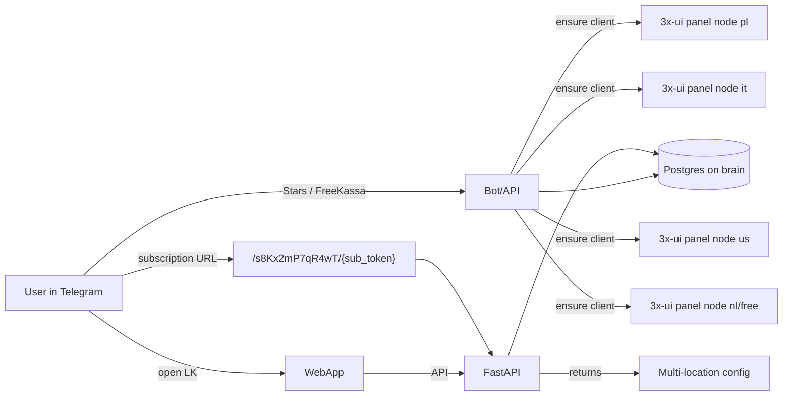

# Overview

Обновлено: 7 марта 2026

PORTAL — Telegram-first сервис с собственным API, WebApp, marketing-сайтом и multi-node выдачей подписки.

## Что важно знать сразу

- production storage сейчас — `Postgres` на brain; локальный `portal.db` остаётся только как локальный/исторический артефакт и не должен считаться источником истины для прода;
- panel-слой построен на `3x-ui + xray-core`;
- production delivery сейчас держится на одном протокольном профиле: `VLESS + TCP + Reality`;
- встроенный subscription server 3x-ui на brain не используется: пользовательскую подписку собирает сам PORTAL.

## Components

- `portal_bot/bot.py` - aiogram bot.
- `portal_bot/api.py` - FastAPI (WebApp + subscription endpoint + admin API).
- `portal_bot/worker.py` - фоновые jobs.
- `portal_bot/control_panel.py` / `portal_bot/panel_client.py` - интеграция с 3x-ui.
- `webapp/` - Telegram WebApp frontend.
- `marketing/` - marketing-site и legal pages.
- `infra/` - systemd units/timers.
- `scripts/` - deploy, smoke, node bootstrap, runtime diagnostics.

## Current runtime topology

- `brain` - control-plane, Postgres, API/bot/helpbot, Caddy, x-ui installed for ops compatibility, но node disabled в текущем delivery pool.
- Enabled delivery nodes: `free`, `it`, `nl`, `pl`, `us`.
- На `pl` дополнительно живёт legacy inbound `8443` (`PL Free Reality`), но primary control-plane runtime опирается на стандартный inbound `443` и отдельную free-ноду `free`.

## Docs

- `docs/02-ops-control-plane.md`
- `docs/03-ops-node.md`
- `docs/08-node-inventory.md`
- `docs/31-capacity-and-infra-runbook-2026-03.md`
- `docs/32-protocols-rf-blocking-rd-2026-03.md`
- `docs/35-node-runtime-and-panel-audit-2026-03-07.md`

## High-Level Flow

