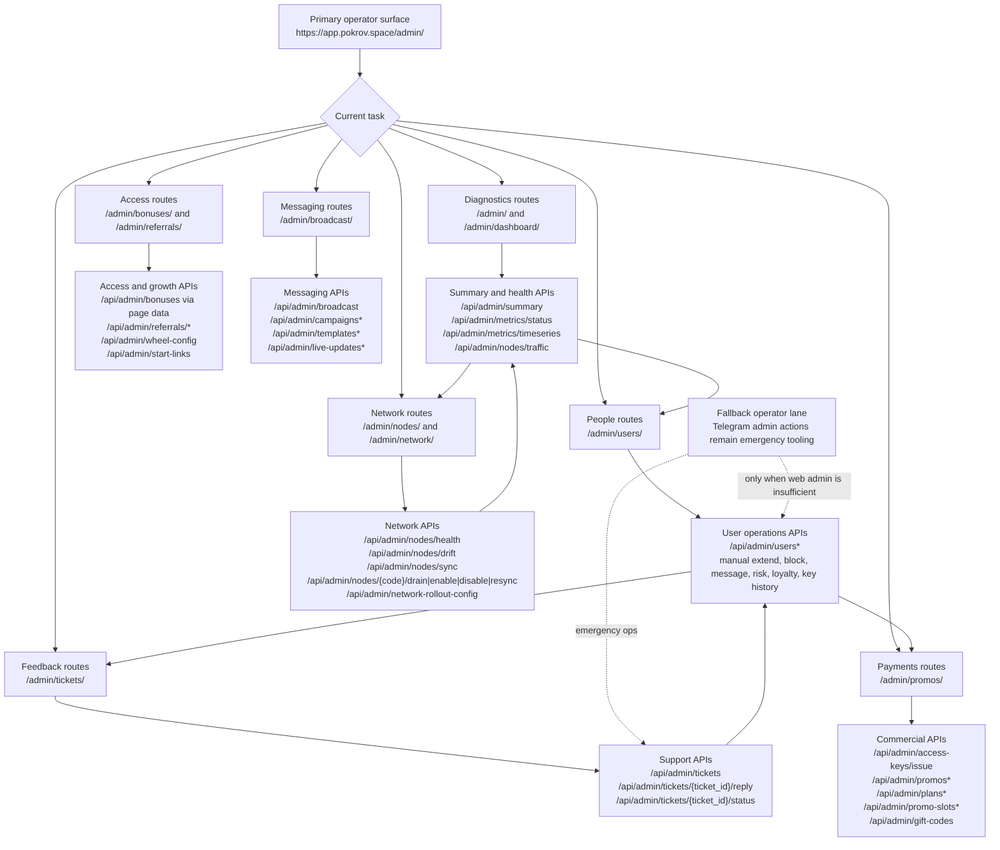

# Current Admin And Operator Journey

Last updated: 2026-04-23

## Basis

This diagram is built from the implemented admin route tree in `webapp/src/app/(dashboard)/admin/`, the admin navigation model in `webapp/src/app/(dashboard)/admin/nav.ts`, and the live admin endpoints exposed by `portal_bot/api.py`.

## Read Notes

- The implemented admin surface already covers the full operator breadth needed by the canon.
- The current route tree is page-complete, but the operator story still reads as many separate surfaces rather than one deliberate task sequence.
- The API surface under `/api/admin/*` is already richer than the route tree alone suggests.
