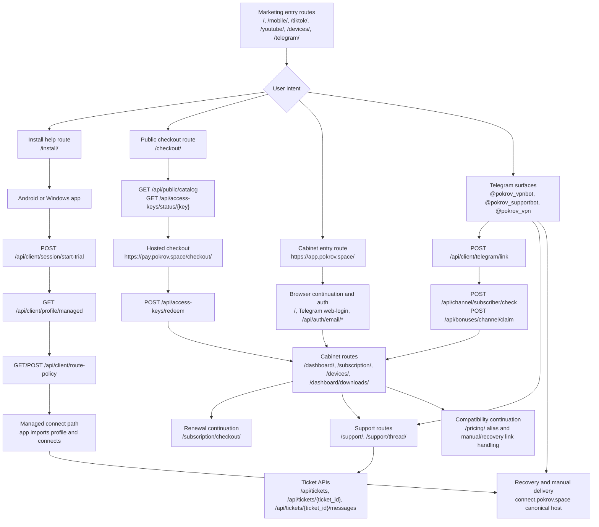

# Current User Journey

Last updated: 2026-04-23

## Basis

This diagram reflects the implemented route and contract surface currently visible in:

- `marketing/src/app/`
- `webapp/src/app/`
- `webapp/README.md`
- `portal_bot/api.py`
- `shared/public-urls.json`

## Read Notes

- The implemented public journey is already split across `marketing`, app-first bootstrap, `webapp`, and Telegram.
- The current state still carries several active continuation seams rather than one single happy path.
- `connect.pokrov.space` is already the canonical connect host, but it still belongs to recovery/manual delivery rather than public acquisition.
