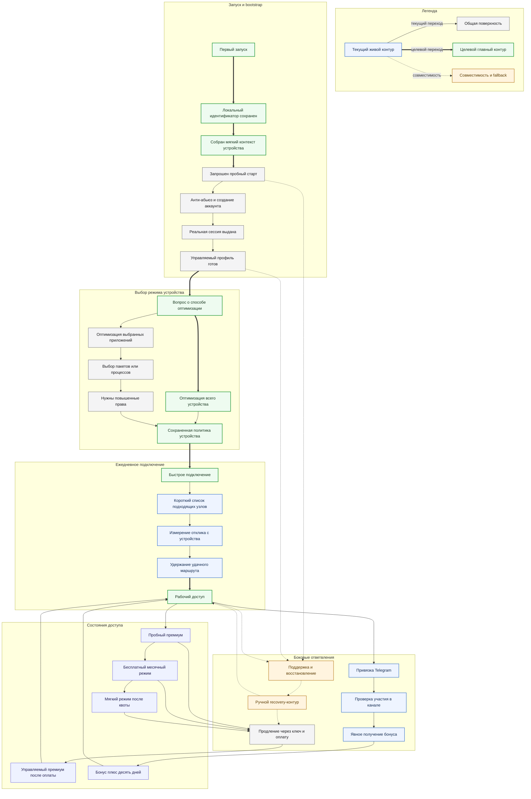
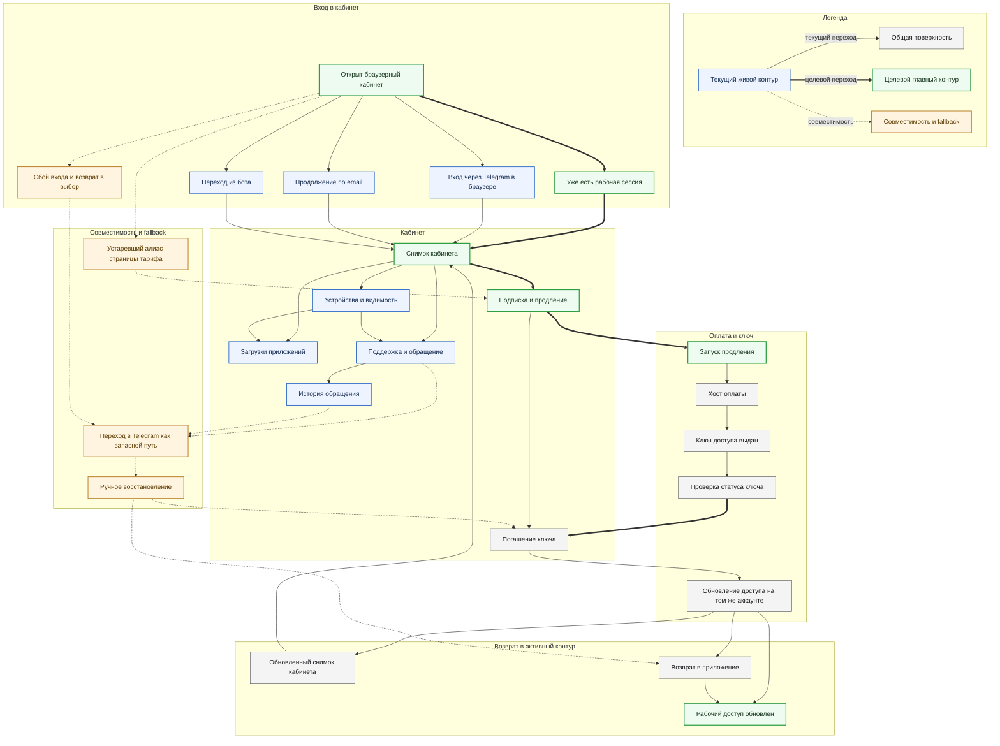
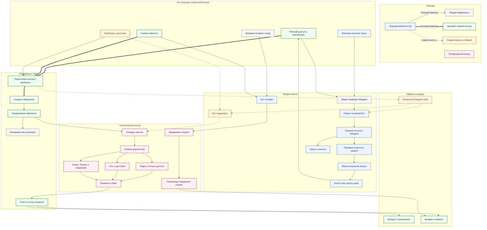
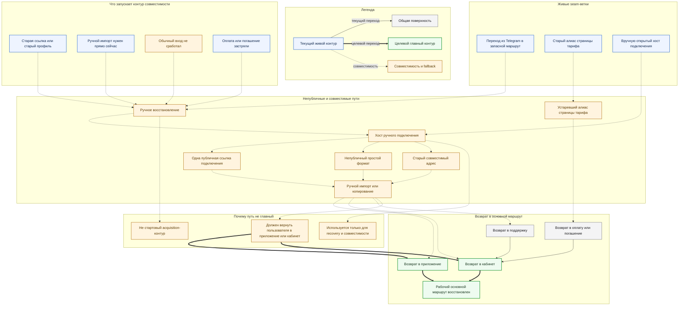

# Супердетальная карта пользовательского маршрута POKROV

Last updated: 2026-04-23

## Статус

Это производный visual-audit артефакт, а не новый канон продукта.
Он собирает в одном месте текущий живой маршрут, целевую каноническую историю, операторский контур и совместимые fallback-ветки.

## Область и правила чтения

- узлы диаграмм подписаны только по-русски
- технические URL, endpoint-семейства, хосты, bot handles и contract names вынесены в примечания под диаграммами
- сплошные стрелки показывают текущие реально живые переходы
- толстые стрелки показывают целевой главный маршрут, который закреплен каноническими документами
- пунктир показывает совместимость, recovery и fallback, которые не должны подменять основной story

## Источники, от которых отталкивается карта

Канон продукта и архитектуры:

- [Product Overview](C:/Users/kiwun/Documents/ai/VPN/docs/product/portal-vpn-product.md)
- [System Overview](C:/Users/kiwun/Documents/ai/VPN/docs/architecture/system-overview.md)
- [App-First And Bonus Flows](C:/Users/kiwun/Documents/ai/VPN/docs/architecture/app-first-and-bonus-flows.md)
- [Monitoring And Visibility](C:/Users/kiwun/Documents/ai/VPN/docs/operations/monitoring-and-visibility.md)
- [POKROV User Guide (RU)](C:/Users/kiwun/Documents/ai/VPN/docs/user/portal-vpn-user-guide-ru.md)
- [POKROV WebApp README](C:/Users/kiwun/Documents/ai/VPN/webapp/README.md)
- [POKROV Client Product Contract](C:/Users/kiwun/Documents/ai/POKROV-app/docs/product/client-product-contract.md)
- [POKROV App-First Onboarding Flow](C:/Users/kiwun/Documents/ai/POKROV-app/docs/architecture/app-first-onboarding-flow.md)

Фактические surface families:

- `marketing/src/app/`: `/`, `/install/`, `/checkout/`, `/devices/`, `/mobile/`, `/telegram/`, `/tiktok/`, `/youtube/`, `/offer/`, `/privacy/`
- `webapp/src/app/`: `/`, `/dashboard/`, `/subscription/`, `/subscription/checkout/`, `/redeem/`, `/devices/`, `/dashboard/downloads/`, `/support/`, `/support/thread/`, `/pricing/`
- `webapp/src/app/(dashboard)/admin/`: diagnostics, users, bonuses, referrals, promos, nodes, network, broadcast, tickets

Ключевые contract families:

- app-first bootstrap: `POST /api/client/session/start-trial`, `GET /api/client/profile/managed`
- browser continuation: Telegram browser auth, additive email auth, bot handoff, dashboard/session family
- commerce: hosted checkout, access-key status, redeem, unified access refresh
- support: `/api/tickets*`
- Telegram bonus: link, membership check, explicit claim
- admin: `/api/admin/*`

## Master Map

Это одна большая current+target карта всей системы маршрутов: от acquisition до app-first, browser continuation, Telegram, compatibility и operator continuation.

```mermaid
flowchart LR
  classDef current fill:#eef4ff,stroke:#316dca,stroke-width:1.5px,color:#10284d;
  classDef target fill:#eefbf0,stroke:#2f9e44,stroke-width:2px,color:#17351d;
  classDef compat fill:#fff4df,stroke:#b7791f,stroke-width:1.5px,color:#5a3a00;
  classDef operator fill:#fff0f6,stroke:#c2255c,stroke-width:1.5px,color:#4d1230;
  classDef shared fill:#f4f4f5,stroke:#52525b,stroke-width:1px,color:#18181b;
  classDef state fill:#eef2ff,stroke:#4f46e5,stroke-width:1px,color:#1e1b4b;

  subgraph LEG["Легенда"]
    LCUR["Текущий живой контур"]
    LTAR["Целевой главный контур"]
    LCOM["Совместимость и fallback"]
    LOPS["Операторский контур"]
    LSH["Общая поверхность"]
    LCUR -->|"текущий переход"| LSH
    LCUR ==>|"целевой переход"| LTAR
    LCUR -. "совместимость" .-> LCOM
  end

  subgraph ENTRY["Вход и намерение"]
    S1["Поиск и индексируемые страницы"]
    S2["Реклама и промо-ссылки"]
    S3["Прямой адрес"]
    S4["Переход из Telegram"]
    S5["Возвратный пользователь"]
    S6["Проблема или восстановление"]
  end

  subgraph PUBLIC["Публичный слой"]
    M1["Главная и публичные страницы"]
    M2["Публичные лендинги под сценарии"]
    M3["Помощь с установкой"]
    M4["Публичный вход в оплату"]
    M5["Вход в браузерный кабинет"]
    M6["Боты и канал"]
  end

  subgraph APP["Приложение и app-first"]
    A1["Первый запуск приложения"]
    A2["Локальный идентификатор устройства"]
    A3["Запрос пробного старта"]
    A4["Анти-абьюз и создание аккаунта"]
    A5["Реальная сессия и доступ"]
    A6["Управляемый профиль готов"]
    A7["Выбор режима устройства"]
    A8["Оптимизация всего устройства"]
    A9["Оптимизация выбранных приложений"]
    A10["Запрос повышенных прав"]
    A11["Быстрое подключение"]
    A12["Умный выбор маршрута"]
    A13["Рабочий доступ"]
    ST1["Пробный премиум"]
    ST2["Бесплатный месячный режим"]
    ST3["Мягкий режим после квоты"]
    ST4["Управляемый премиум после оплаты"]
  end

  subgraph WEB["Браузерное продолжение"]
    W1["Продолжение сессии"]
    W2["Вход через Telegram в браузере"]
    W3["Продолжение по email"]
    W4["Переход из бота в кабинет"]
    W5["Снимок кабинета"]
    W6["Загрузки приложений"]
    W7["Устройства и видимость"]
    W8["Подписка и продление"]
    W9["Погашение ключа"]
    W10["Поддержка и обращение"]
    W11["История обращения"]
  end

  subgraph PAY["Коммерция и обновление доступа"]
    P1["Хост оплаты"]
    P2["Ключ доступа"]
    P3["Проверка статуса ключа"]
    P4["Обновление доступа на том же аккаунте"]
  end

  subgraph TG["Telegram как вторичный слой"]
    T1["Привязка Telegram"]
    T2["Основной бот"]
    T3["Проверка подписки на канал"]
    T4["Явное получение бонуса"]
    T5["Бонус плюс десять дней"]
    T6["Бот поддержки"]
    T7["Бот отзывов"]
    T8["Канал и новости"]
  end

  subgraph COMP["Совместимость и восстановление"]
    C1["Ручное восстановление"]
    C2["Хост ручного подключения"]
    C3["Устаревший путь совместимости"]
    C4["Непубличный простой формат"]
    C5["Алиас старой страницы тарифа"]
  end

  subgraph OPS["Операторский контур"]
    O1["Вход оператора в веб-админку"]
    O2["Снимок диагностики и статусов"]
    O3["Очередь тикетов и обращений"]
    O4["Люди и статусы доступа"]
    O5["Сеть и доставка"]
    O6["Ключи, промо и продление"]
    O7["Ответ, решение и проверка эффекта"]
    O8["Модерация отзывов"]
    O9["Публикация избранного отзыва"]
  end

  S1 --> M1
  S2 --> M1
  S3 --> M1
  S4 --> M6
  S5 --> M5
  S6 --> C1

  M1 --> M2
  M1 --> M3
  M1 --> M4
  M1 --> M5
  M1 --> M6
  M2 --> M3
  M2 --> M4
  M2 --> M5
  M6 --> T2
  M6 --> T6
  M6 --> T8

  M3 ==> A1
  A1 ==> A2
  A2 ==> A3
  A3 --> A4
  A4 --> A5
  A5 --> A6
  A6 ==> A7
  A7 ==> A8
  A7 --> A9
  A9 --> A10
  A10 --> A11
  A8 ==> A11
  A11 ==> A12
  A12 ==> A13
  A13 --> ST1
  ST1 --> ST2
  ST2 --> ST3

  A13 --> T1
  T1 --> T2
  T2 --> T3
  T3 --> T4
  T4 --> T5
  T5 --> A13

  M5 ==> W1
  M5 --> W2
  M5 --> W3
  M5 --> W4
  T2 --> W4
  W2 --> W1
  W3 --> W1
  W4 --> W1
  W1 ==> W5
  W5 --> W6
  W5 --> W7
  W5 --> W8
  W5 --> W10
  W10 --> W11

  M4 ==> P1
  W8 --> P1
  A13 --> P1
  ST2 --> P1
  ST3 --> P1
  T2 --> P1
  P1 --> P2
  P2 --> P3
  P3 --> W9
  W9 --> P4
  P4 --> ST4
  ST4 --> A13
  P4 --> W5

  A13 --> W10
  C1 -.-> W10
  C1 -.-> T6
  C1 -.-> C2
  C2 -.-> C3
  C2 -.-> C4
  C3 -.-> A13
  C3 -.-> W5
  C5 -.-> W8
  M5 -.-> C5

  W10 --> O3
  T6 -.-> O3
  O1 --> O2
  O2 --> O3
  O2 --> O4
  O2 --> O5
  O2 --> O6
  O3 --> O7
  O4 --> O7
  O5 --> O7
  O6 --> O7
  O7 --> W11
  O7 --> W5
  O7 --> A13

  A13 --> T7
  W5 --> T7
  T7 --> O8
  O8 --> O9
  O9 --> M1
  O9 --> W5

  class LCUR,M2,M6,W2,W3,W4,T2,T3,T4,T5 current;
  class LTAR,M3,M4,M5,A1,A2,A3,A6,A7,A8,A11,A12,W1,T1 target;
  class LCOM,C1,C2,C3,C4,C5 compat;
  class LOPS,O1,O2,O3,O4,O5,O6,O7,O8,O9 operator;
  class ST1,ST2,ST3,ST4 state;
  class LSH,S1,S2,S3,S4,S5,S6,M1,A4,A5,A9,A10,A13,W5,W6,W7,W8,W9,W10,W11,P1,P2,P3,P4,T6,T7,T8 shared;
```

**Как читать master-карту**

- Старт: пользователь может зайти через поиск, прямой адрес, рекламу, Telegram, возвратный browser entry или уже из проблемы/recovery.
- Пользователь получает: либо основной маршрут `сайт -> установка -> приложение -> пробный старт -> режим устройства -> connect`, либо continuation в кабинет, оплату, Telegram reward, support или compatibility recovery.
- Система ждет: создание app-first account/session, managed profile readiness, session continuation in browser, checkout key issuance, redeem refresh, ticket/admin processing и review moderation.
- Следующая поверхность: `marketing`, приложение, `webapp`, hosted checkout, Telegram, `connect` host, web admin.
- Fallback: пунктирные ветки сознательно отводят пользователя в recovery, Telegram support или совместимые seam-paths, а не заменяют основной story.

Технические якоря master-карты:

- публичные поверхности: `https://pokrov.space/`, `https://app.pokrov.space/`, `https://connect.pokrov.space/`, `https://pay.pokrov.space/checkout/`
- app-first bootstrap: `POST /api/client/session/start-trial`, `GET /api/client/profile/managed`
- browser continuation: Telegram browser login, additive email auth, bot handoff, `GET /api/dashboard`, `GET /api/client/apps`
- commerce: hosted checkout, `GET /api/access-keys/status/{key}`, `POST /api/access-keys/redeem`
- support/admin: `/api/tickets*`, `/api/admin/*`
- Telegram bonus: `POST /api/client/telegram/link`, `POST /api/channel/subscriber/check`, `POST /api/bonuses/channel/claim`

## Детализация 1. App-first bootstrap, route mode и connect

- Что запускает ветку: первый запуск приложения, `Try free`, route-mode onboarding, повторный connect, renewal после trial/free.
- Что пользователь получает: реальную сессию, реальный managed profile, выбор между `всё устройство` и `только выбранные приложения`, быстрый connect и понятные состояния доступа.
- Что система ждет: `install_id`, мягкий device context, anti-abuse verdict, session/access/provisioning payload, managed profile readiness, shortlist/smart-connect данные, later key/redeem refresh.
- Что дальше: либо ежедневное подключение, либо Telegram bonus branch, либо paid renewal, либо support.
- Какой fallback: support/recovery и ручной compatibility contour, который не должен заменять normal quick-connect story.

Технические якоря этой ветки:

- `POST /api/client/session/start-trial`
- `GET /api/client/profile/managed`
- `POST /api/client/nodes/latency-samples`
- route-mode contract: `route_mode`, `selected_apps`, `requires_elevated_privileges`, mirrored `route_policy.*`

## Детализация 2. Browser cabinet, checkout и redeem

- Что запускает ветку: known user открывает `app.pokrov.space`, приходит из бота, продолжает browser session, хочет renew/redeem, или приходит решать support/download task.
- Что пользователь получает: один session-aware cabinet snapshot, downloads, devices, subscription state, support thread, hosted renewal continuation и redeem на том же app-first account.
- Что система ждет: существующую browser session family, Telegram/email/bot handoff, hosted checkout key issuance, key status, redeem, unified access refresh.
- Что дальше: возврат в dashboard, возврат в приложение, support continuation, fallback в Telegram только если normal continuation не сработал.
- Какой fallback: `/pricing/` и Telegram запасной маршрут остаются seam-ветками, а не отдельной новой публичной paywall story.

Технические якоря этой ветки:

- cabinet routes: `/`, `/dashboard/`, `/subscription/`, `/subscription/checkout/`, `/redeem/`, `/devices/`, `/dashboard/downloads/`, `/support/`, `/support/thread/`
- auth families: Telegram browser login, additive email auth, bot `web_session_token`
- commerce families: hosted checkout, `GET /api/access-keys/status/{key}`, `POST /api/access-keys/redeem`

## Детализация 3. Telegram, support, recovery и operator continuation

- Что запускает ветку: получение бонуса, проблемы с подключением, переход в support, желание оставить feedback/review.
- Что пользователь получает: привязку Telegram, explicit bonus claim, real ticket continuation, operator reply и возможный возврат в app/cabinet.
- Что система ждет: linked Telegram identity, channel membership verdict, explicit claim, ticket context, admin diagnostics, resolution action, review moderation.
- Что дальше: либо обратно в приложение/кабинет с решенным кейсом, либо в fallback Telegram-support, либо на publication branch для approved review.
- Какой fallback: Telegram support остается вторичным recovery path, а не нормальной заменой app/web support.

Технические якоря этой ветки:

- Telegram: `POST /api/client/telegram/link`, `POST /api/channel/subscriber/check`, `POST /api/bonuses/channel/claim`
- support: `/api/tickets`, `/api/tickets/{ticket_id}`, `/api/tickets/{ticket_id}/messages`, `/api/tickets/uploads`
- bots: `@pokrov_vpnbot`, `@pokrov_supportbot`, `@pokrov_feedbackbot`, `@pokrov_vpn`
- admin: `/api/admin/tickets*`, `/api/admin/summary`, `/api/admin/nodes/health`, `/api/admin/users*`

## Детализация 4. Compatibility, manual recovery и legacy seams

- Что запускает ветку: старые профили, ручной import, recovery после failed primary flow, stuck payment/redeem, старые алиасы.
- Что пользователь получает: возможность вручную дотянуться до connect/recovery path и затем вернуться в приложение, кабинет или support.
- Что система ждет: осознанный recovery intent, manual open/import, compatibility status, возврат пользователя из seam-path обратно в основной маршрут.
- Что дальше: правильный финал этой ветки всегда не в manual path, а в возврате в `app` или `web cabinet`.
- Какой fallback: вся диаграмма сама является fallback; она не должна становиться acquisition story или основной оплатой/подключением.

Технические якоря этой ветки:

- canonical connect host: `https://connect.pokrov.space/`
- hidden compatibility override: `?format=plain`
- legacy compatibility path: older `api.pokrov.space/s8Kx2mP7qR4wT/...`
- migration-only legacy host: `kiwunaka.space`
- compatibility alias in webapp: `/pricing/`

## Что эта карта явно покрывает

- новый пользователь: `marketing -> install -> app -> Try free -> route mode -> connect`
- известный пользователь: `marketing or app.pokrov.space -> session continuation -> dashboard`
- paid upgrade: `checkout -> activation key -> redeem -> managed premium refresh`
- Telegram bonus: `link -> membership check -> explicit claim -> +10 days`
- support/recovery: `app -> web cabinet -> Telegram fallback`
- compatibility/manual path: `connect.pokrov.space` как recovery/manual delivery, но не default acquisition
- operator continuation: ticket/admin lane, который реально касается support, renew, redeem, diagnostics и review publication

## Связанные редактируемые Mermaid-файлы

- [06-master-current-target-supermap.mmd](C:/Users/kiwun/Documents/ai/VPN/docs/developer/work-orders/2026-04-22--pokrov-global-rework/worker-8-visual-audit/detailed-user-flows/06-master-current-target-supermap.mmd)
- [07-app-bootstrap-route-mode-and-connect.mmd](C:/Users/kiwun/Documents/ai/VPN/docs/developer/work-orders/2026-04-22--pokrov-global-rework/worker-8-visual-audit/detailed-user-flows/07-app-bootstrap-route-mode-and-connect.mmd)
- [08-browser-cabinet-checkout-and-redeem.mmd](C:/Users/kiwun/Documents/ai/VPN/docs/developer/work-orders/2026-04-22--pokrov-global-rework/worker-8-visual-audit/detailed-user-flows/08-browser-cabinet-checkout-and-redeem.mmd)
- [09-telegram-support-recovery-and-operator.mmd](C:/Users/kiwun/Documents/ai/VPN/docs/developer/work-orders/2026-04-22--pokrov-global-rework/worker-8-visual-audit/detailed-user-flows/09-telegram-support-recovery-and-operator.mmd)
- [10-compatibility-manual-recovery-and-legacy-seams.mmd](C:/Users/kiwun/Documents/ai/VPN/docs/developer/work-orders/2026-04-22--pokrov-global-rework/worker-8-visual-audit/detailed-user-flows/10-compatibility-manual-recovery-and-legacy-seams.mmd)
