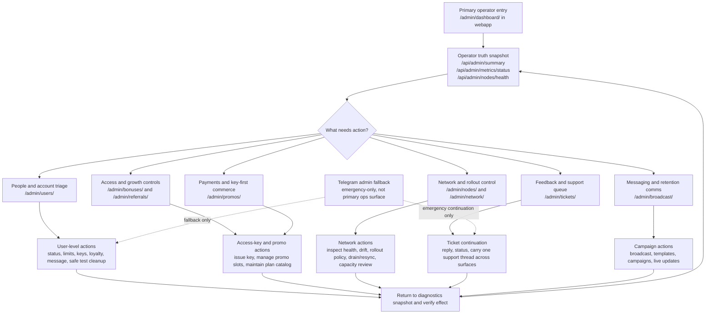

# Target Admin And Operator Journey

Last updated: 2026-04-23

## Basis

This target view is grounded in the existing admin navigation categories, the root canonical docs, and the already-live admin endpoint families.

It shows the preferred operator journey, not a speculative new route map.

## Read Notes

- The target operator path is diagnostics-led, then task-based.
- The existing route families already support this target view; the missing piece is consistent explanation and usage discipline.
- Telegram admin remains in the picture, but only as fallback.
