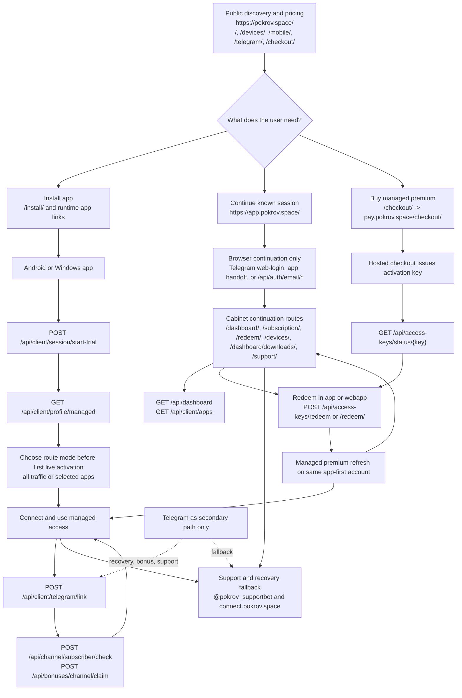

# Target User Journey

Last updated: 2026-04-23

## Basis

This diagram reflects the target-state journey frozen by the current canon in:

- `docs/product/portal-vpn-product.md`
- `docs/architecture/system-overview.md`
- `docs/architecture/app-first-and-bonus-flows.md`
- `docs/operations/monitoring-and-visibility.md`

The path keeps only implemented route families and contract seams that already exist today, but reorders them into the preferred target story.

## Read Notes

- The target story collapses public onboarding to `marketing -> install -> app-first trial -> connect`.
- `webapp` remains important, but only as continuation, renew, redeem, download, and support surface.
- Telegram stays in the journey, but only as a secondary lane.
